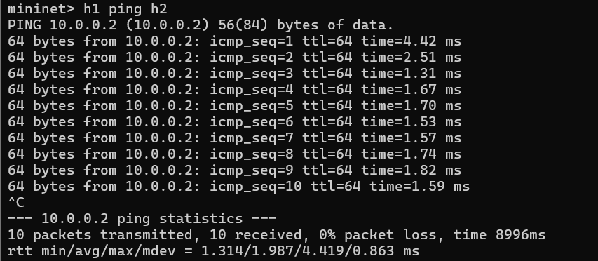
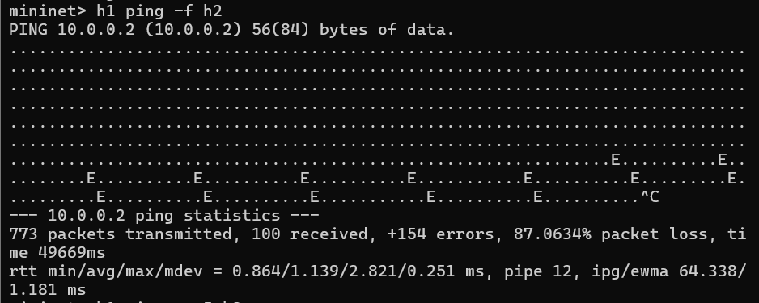
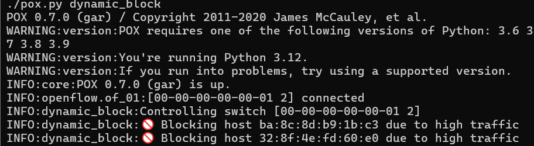
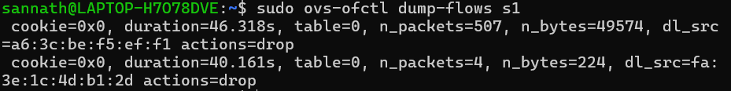
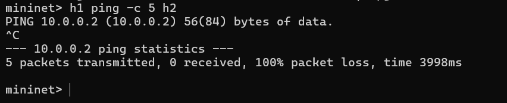

# SDN Dynamic Host Blocking using POX and Mininet

## Problem Statement

This project implements a Software Defined Networking (SDN) solution to dynamically detect and block hosts generating abnormal traffic. The controller monitors packet rates and installs flow rules in the switch to block malicious hosts.

---

## Objective

* Demonstrate controller–switch interaction
* Implement dynamic flow rule installation (match–action)
* Detect abnormal traffic behavior
* Block hosts dynamically using SDN controller

---

## Network Topology

```
h1 ----\
        s1 ---- Controller (POX)
h2 ----/
h3 ----/
```

---

## Technologies Used

* Mininet (network emulation)
* POX Controller (OpenFlow)
* Open vSwitch (OVS)
* Python

---

## Working Principle

* The controller monitors incoming packets (`packet_in` events)
* It tracks packet rate per host within a time window
* If traffic exceeds a threshold:

  * A flow rule is installed
  * Matching: source MAC address
  * Action: DROP
* This blocks the host dynamically

---

## Flow Rule Logic

* Match: `dl_src = <host MAC>`
* Action: `DROP`
* Installed dynamically upon threshold violation

---

## How to Run

### Step 1: Start POX Controller

```
cd ~/pox
./pox.py dynamic_block
```

### Step 2: Start Mininet

```
sudo mn --topo single,3 --controller remote --switch ovsk
```

---

## Test Scenarios

### Normal Traffic

```
h1 ping -c 5 h2
```

* Successful communication
* No blocking

---

### High Traffic (Attack Simulation)

```
h1 ping -f h2
```

* Generates high packet rate
* Controller detects abnormal behavior

---

### After Blocking

```
h1 ping -c 5 h2
```

* Communication fails
* Host is blocked

---

## Verification

### Flow Table

```
sudo ovs-ofctl dump-flows s1
```

Expected output:

```
dl_src=... actions=drop
```

---

## Screenshots

### Normal Ping



### Flood Attack



### Blocking Log



### Flow Table



### After Blocking



---

## Observations

* Normal traffic flows without issues
* High traffic triggers detection
* Controller dynamically installs drop rules
* Network behavior changes in real time

---

## Key Concepts Demonstrated

* SDN architecture
* OpenFlow protocol
* Packet_in handling
* Match–Action flow rules
* Dynamic network control

---

## Limitations

* Simple threshold-based detection
* No advanced intrusion detection
* Blocking is permanent (no timeout)

---

## Future Improvements

* Add time-based unblock mechanism
* Use machine learning for detection
* Implement rate limiting instead of full blocking

---

## References

* POX Controller Documentation
* Mininet Documentation
* OpenFlow Specification

---

## Conclusion

This project successfully demonstrates dynamic traffic monitoring and control using SDN. It highlights how centralized controllers can enforce network policies in real time.
